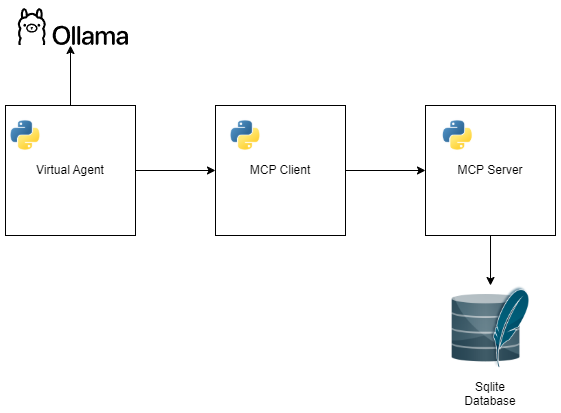

          
# Car-MCP: Automobile Search System

A car search system that uses the MCP (Model-Client-Protocol) protocol and a virtual agent to facilitate vehicle searches through natural language.

## 📋 About the Project

Car-MCP is a system that allows users to search for automobiles using natural language. The system employs a virtual agent that interprets user requests, extracts search criteria, and presents results in a user-friendly manner.

### Main Features

- **Natural language search**: Allows users to describe the car they're looking for in natural language
- **Advanced filtering**: Supports filtering by brand, model, year, price, fuel type, color, transmission, and more
- **Interactive virtual agent**: Converses with the user to refine the search when necessary
- **Vehicle database**: Stores and manages detailed information about automobiles

## 🏗️ System Architecture

The project follows an architecture based on the MCP (Model-Client-Protocol) protocol:



### Main Components

- **Virtual Agent**: Conversation interface that interprets user requests and sends them to LLM (Ollama) to organize filters that will be used in the database
- **MCP Client**: Manages communication with the MCP server using Server-Sent Events (SSE)
- **MCP Server**: Processes queries and returns results from the database
- **Database**: Stores information about automobiles

## 📦 Package Structure

```
car-mcp/
├── car_mcp/                  # Main package
│   ├── agent/                # Virtual agent module
│   │   ├── agent.py          # Virtual agent implementation
│   │   └── local_ollama.py   # Ollama LLM model configuration
│   ├── database/             # Database module
│   │   ├── data_generator.py # Fictional data generator
│   │   └── db_manager.py     # Database manager
│   ├── mcp/                  # MCP communication module
│   │   └── client.py         # MCP Client
│   │   └── server.py         # MCP Server
│   ├── models/               # Data models
│   └── config.py             # System configurations
├── scripts/                  # Utility scripts
│   └── create_database.py    # Database initialization script
├── tests/                    # Automated tests
│   ├── test_agent.py         # Virtual agent tests
│   ├── test_mcp_client.py    # MCP client tests
│   └── test_mcp_server.py    # MCP server tests
└── pyproject.toml            # Project configuration and dependencies
```

## 🚀 Getting Started Using Docker Compose
This project uses Docker and docker-compose to manage the development environment.

### Prerequisites for Docker

- Docker or Docker Desktop (for Windows) and docker-compose
- Ollama (for the local LLM model)

### Steps to Run the Project Using Docker Compose
1. Clone the repository:
   ```bash
   git clone https://github.com/thiagosena/car-mcp.git
   cd car-mcp
   ```
2. Build and run the containers:
   ```bash
   docker-compose up --build
   ```
3. Execute the following commands to start the server and the agent:
   ```bash
   docker-compose up -d mcp-server
   docker-compose run --rm agent
   ```  

## 🐳 How to Run the Project Using DevContainers

This project supports development with DevContainers, allowing for a consistent and isolated development environment.

### Prerequisites for DevContainers

- Docker or Docker Desktop (for Windows)
- Visual Studio Code - https://code.visualstudio.com/
- "Remote - Containers" extension in VS Code
- Ollama (for the local LLM model) - https://ollama.com/

### Steps to Use DevContainers

1. Clone the repository and open the project in VS Code:
   ```bash
   git clone https://github.com/thiagosena/car-mcp.git
   cd car-mcp
   code .
   ```
2. Click on the blue icon in the bottom-left corner
3. Select "Reopen in Container"
4. Wait for the container to build

The container will come pre-configured with all the necessary dependencies for development.


### Configure environment variables
Configure environment variables (create a `.env` file in the project root):
   ```
   OLLAMA_MODEL=llama2
   OLLAMA_BASE_URL=http://192.168.100.35:11434
   OLLAMA_TEMPERATURE=0.7
   OLLAMA_REPEAT_PENALTY=1.1
   OLLAMA_TIMEOUT=120
   MCP_SERVER_URL=http://localhost:8000/sse
   ```
#### Or you can set the environment variables in the .bashrc file
1. Open .bashrc file
```bash
vim ~/.bashrc
```
2. Add the following lines:
```
export OLLAMA_MODEL=llama2
export OLLAMA_BASE_URL=http://192.168.100.35:11434
export OLLAMA_TEMPERATURE=0.7
export OLLAMA_REPEAT_PENALTY=1.1
export OLLAMA_TIMEOUT=120
export MCP_SERVER_URL=http://192.168.100.35:11434
```
3. Then update bashrc
```bash
source ~/.bashrc
```

### Database Initialization

Run the script to create and populate the database with fictional data:

```bash
python -m scripts.create_database
```

### Running the System

1. Start the MCP server
```bash
python -m car_mcp.mcp.server
```

2. Start the virtual agent
```bash
python -m car_mcp.agent.agent
```

## 📚 Main Dependencies

- **sqlalchemy**: ORM for database operations
- **pandas**: Data manipulation and analysis
- **faker** and **faker-vehicle**: Fictional data generation
- **langchain** and **langchain-ollama**: Integration with language models
- **mcp**: Model-Client-Protocol implementation
- **colorama**: Colored terminal formatting
- **pytest**: Testing framework

For a complete list of dependencies, see the `pyproject.toml` file.

## 🧪 Running Tests

To run automated tests:

```bash
pytest
```

To run tests with coverage:

```bash
pytest --cov=car_mcp --cov-report=html
```

## 🛠️ Development Tools

The project uses the following development tools:

- **pytest**: Testing framework

## ✅ Tests and Coverage

The project's test coverage is as follows:


## 👨‍💻 Author

- **Thiago Sena** - [thiagosena.dev@gmail.com](mailto:thiagosena.dev@gmail.com)